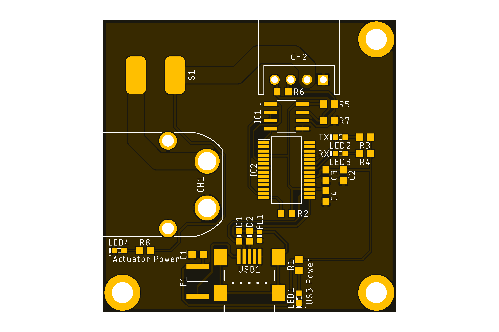

<html lang="en">
  <head>
    <meta charset="uft-8">
    <meta name="author" content="Masato Kubotera">
  </head>
  <body>
    <h1>USB-RS485 Conversion Adapter Ver. 2.1</h1>
    <h2>About USB-RS485 Conversion Adapter</h2>
    

      The USB-RS485 Conversion Adapter converts communications from the USB interface to the RS-485 interface and can drive KONDO B3M series servo motors. 
       
      Note that this is Ver. 2.1. For other versions, please refer to the following repositories.
      <ul>
        <li><a href="https://github.com/MasatoKubotera/USB-RS485_ConversionAdapter_ver2_0">USB-RS485 Conversion Adapter Ver. 2.0</a></li>
      </ul>
      <h2>About Ver. 2.1</h2>
      Ver. 2.1 has a switch and four indicator LEDs to turn the power supply for driving servo motors on and off on the board.
      <!--
      Ver.2.1では、サーボモーター駆動用の電源を基板上でON/OFFするためのスイッチと4つのインジケーターLEDを搭載しています。
      -->
      <table>
        <tr>
          <td>
            <a href="image/brd_top.png">
              

                
              

            </a>
          </td>
          <td>
            

              
            

          </td>
          <td>
            

              
            

          </td>
        </tr>
        <tr>
          <td>
            

              PCB preview image
            

          </td>
          <td>
            

              Actual PCB
            

          </td> 
          <td>
            

              After component mounting
            

          </td>   
        </tr>
      </table>
    

    <h2>Repository Contents</h2>
    

    <dl>
      <dt>\image</dt>
      <dd>PCB preview images and capture of design screen</dd>
      <dt>\libraries</dt>
      <dd>Libraries used in Autodesk Eagle design</dd>
      <dt>Schematic.pdf</dt>
      <dd>Circuit diagram of this product</dd>
      <dt>BOM.txt</dt>
      <dd>Parts lists output from design data</dd>
      <dt>.brd</dt>
      <dd>Board wiring design file by Autodesk Eagle</dd>
      <dt>.sch</dt>
      <dd>Schematic design file by Autodesk Eagle</dd>
      <dt>Gerber_data.zip</dt>
      <dd>Zip folder of Gerber format files for PCB manufacturing requests.</dd>
      <dt>LICENSE</dt>
      <dd>This is a license to use this product. Please confirm before use.</dd>
      <dt>.gitignore</dt>
      <dd>File to exclude cache files from management.</dd>
    </dl>
    

    <h2>Documentation</h2>
      

        <h3>BOM</h3>
          <table>
            <thead>
              <tr>
                <th> Eagle Design Parts # </th>
                <th> Q'ty </th>
                <th> Mfr. Product # </th>
                <th> Supplier </th>
                <th> Description </th>
              </tr>
            </thead>
            <tbody>
              <tr>
                <td> LED1, LED4 </td>
                <td> 2 </td>
                <td> 150060VS86000 </td>
                <td> <a href="https://www.mouser.jp/ProductDetail/Wurth-Elektronik/150060VS86000?qs=GedFDFLaBXGW9qOjzZ1Hmw%3D%3D">Mouser</a> </td>
                <td> Standard LEDs - SMD Green 2V 20mA 573nm 0603 </td>
              </tr>
              <tr>
                <td> LED2, LED3 </td>
                <td> 2 </td>
                <td> 150060YS75000 </td>
                <td> <a href="https://www.mouser.jp/ProductDetail/Wurth-Elektronik/150060YS75000?qs=LlUlMxKIyB0nKmwefHgtZw%3D%3D">Mouser</a> </td>
                <td> Standard LEDs - SMD Yellow 2V 20mA 590nm 0603 </td>
              </tr>
              <tr>
                <td> FL1 </td>
                <td> 1 </td>
                <td> BLM18SD220SN1D </td>
                <td> <a href="https://www.mouser.jp/ProductDetail/Murata-Electronics/BLM18SD220SN1D?qs=glnLrWX4TPq%2Fm8%2FdPQltLg%3D%3D">Mouser</a> </td>
                <td> Ferrite Beads 22 OHM 0603 </td>
              </tr>
              <tr>
                <td> R1, R3, R4 </td>
                <td> 3 </td>
                <td> RC0603FR-101KL </td>
                <td> <a href="https://www.mouser.jp/ProductDetail/YAGEO/RC0603FR-101KL?qs=EiqXWrxQq63MM0wzm69ZKg%3D%3D">Mouser</a> </td>
                <td> Thick Film Resistors - SMD 1 kOhms 100-200mW 1% 0603 </td>
              </tr>
              <tr>
                <td> R2 </td>
                <td> 1 </td>
                <td> RC0603FR-1310KL </td>
                <td> <a href="https://www.mouser.jp/ProductDetail/YAGEO/RC0603FR-1310KL?qs=EiqXWrxQq61KPbFOr8F%252BoA%3D%3D">Mouser</a> </td>
                <td> Thick Film Resistors - SMD 10 kOhms 100-200mW 1% 0604 </td>
              </tr>
              <tr>
                <td> R6 </td>
                <td> 1 </td>
                <td> RC0603FR-10120RL </td>
                <td> <a href="https://www.mouser.jp/ProductDetail/YAGEO/RC0603FR-10120RL?qs=EiqXWrxQq62dlPwl17gZoA%3D%3D">Mouser</a> </td>
                <td> Thick Film Resistors - SMD 120 Ohms 100-200mW 1% 0605 </td>
              </tr>
              <tr>
                <td> R5, R7 </td>
                <td> 2 </td>
                <td> RC0603FR-10680RL </td>
                <td> <a href="https://www.mouser.jp/ProductDetail/YAGEO/RC0603FR-10680RL?qs=kV3c90BOhBEc15QHcN6V1g%3D%3D">Mouser</a> </td>
                <td> Thick Film Resistors - SMD 680 Ohms 100-200mW 1% 0606 </td>
              </tr>
              <tr>
                <td> R8 </td>
                <td> 1 </td>
                <td> RC0603FR-102KL </td>
                <td> <a href="https://www.mouser.jp/ProductDetail/YAGEO/RC0603FR-102KL?qs=EiqXWrxQq61%2FIgp1yfYYog%3D%3D">Mouser</a> </td>
                <td> Thick Film Resistors - SMD 2 kOhms 100-200mW 1% 0607 </td>
              </tr>
              <tr>
                <td> C1 </td>
                <td> 1 </td>
                <td> GRM188B11H103KA01 </td>
                <td> <a href="https://www.google.com/search?q=GRM188B11H103KA01&oq=GRM188B11H103KA01&aqs=chrome.0.69i59.262j0j7&sourceid=chrome&ie=UTF-8">Akizuki</a> </td>
                <td> Multilayer Ceramic Capacitors SMD/SMT 0.01uF 50V 10% 0603 </td>
              </tr>
              <tr>
                <td> C2, C4 </td>
                <td> 2 </td>
                <td> GCM188L81H104K57 </td>
                <td> <a href="https://akizukidenshi.com/catalog/g/gP-16143/">Akizuki</a> </td>
                <td> Multilayer Ceramic Capacitors SMD/SMT 0.1uF 50V 10% 0603 </td>
              </tr>
              <tr>
                <td> C3 </td>
                <td> 1 </td>
                <td> C1608X5R1C475K080AE </td>
                <td> <a href="https://www.mouser.jp/ProductDetail/TDK/C1608X5R1C475K080AE?qs=j%252B1pi9TdxUYQJQlE8Tiuyw%3D%3D">Mouser</a> </td>
                <td> Multilayer Ceramic Capacitors SMD/SMT 4.7uF 16V 10% 0603 </td>
              </tr>
              <tr>
                <td> D1, D2 </td>
                <td> 2 </td>
                <td> CG0603MLC-05E </td>
                <td> <a href="https://www.mouser.jp/ProductDetail/Bourns/CG0603MLC-05E?qs=lDok7oSghXVLNKMK69q%252BFQ%3D%3D">Mouser</a> </td>
                <td> ESD Protectors 5V 0603 </td>
              </tr>
              <tr>
                <td> CH1 </td>
                <td> 1 </td>
                <td> XT60PW-M </td>
                <td> <a href="https://store.shopping.yahoo.co.jp/suzakulab/amass-xt60pw-m.html">Suzaku Lab.</a> </td>
                <td> DC Power Connector, Through Hole, Horizontal, Male, 30A 500V </td>
              </tr>
              <tr>
                <td> CH2 </td>
                <td> 1 </td>
                <td> S4B-XH-A(LF)(SN) </td>
                <td> <a href="https://akizukidenshi.com/catalog/g/gC-12842/">Akizuki</a> </td>
                <td> Connector Header Through Hole, Right Angle 4 position 2.5mm </td>
              </tr>
              <tr>
                <td> USB1 </td>
                <td> 1 </td>
                <td> MUSB-5B-NE-S175 </td>
                <td> <a href="https://akizukidenshi.com/catalog/g/gC-05843/">Akizuki</a> </td>
                <td> Mini USB Connector 5P B type, Female, SMT type, without standoff </td>
              </tr>
              <tr>
                <td> F1 </td>
                <td> 1 </td>
                <td> MF-MSMF050-2 </td>
                <td> <a href="https://www.mouser.jp/ProductDetail/Bourns/MF-MSMF050-2?qs=t3shhpq1i1DZ7OBD5kLNoA%3D%3D">Mouser</a> </td>
                <td> PTC Resettable Fuses 15V .5A-HD 100A MAX </td>
              </tr>
              <tr>
                <td> IC1 </td>
                <td> 1 </td>
                <td> ADM3078E*1 </td>
                <td> <a href="https://www.mouser.jp/ProductDetail/Analog-Devices/ADM3078EARZ?qs=BpaRKvA4VqGLm2ZAElC2YA%3D%3D">Mouser</a> </td>
                <td> RS-485/RS-422 Transceiver (Half Duplex, 16 Mbps, DE/RE) </td>
              </tr>
              <tr>
                <td> IC2 </td>
                <td> 1 </td>
                <td> FT232RL </td>
                <td> <a href="https://akizukidenshi.com/catalog/g/gI-01739/">Akizuki</a> </td>
                <td> USB Interface IC USB to Serial UART </td>
              </tr>
              <tr>
                <td> S1 </td>
                <td> 1 </td>
                <td> DS-850K-S-ON </td>
                <td> <a href="https://akizukidenshi.com/catalog/g/gP-15740/">Akizuki</a> </td>
                <td> Rocker Switches 125VAC 5A </td>
              </tr>
            </tbody>
          </table>
          <strong>*1</strong> : Since the <a href="https://www.mouser.jp/ProductDetail/Analog-Devices/ADM3078EARZ?qs=BpaRKvA4VqGLm2ZAElC2YA%3D%3D">ADM3078E</a> from Analog Devices was not available at the time of fabrication, the <a href="https://akizukidenshi.com/catalog/g/gI-16211//">MAX3485ED</a> from HTC Korea was used as an alternative.
        <h3>PCB Fabrication</h3>
          PCB(Printed Circuit Board) manufacturing was outsourced to <a href="https://www.elecrow.com/pcb-manufacturing.html">Elecrow</a>. 
          The custom specifications are as follows.
          <ul>
            <li>Layer : 2 layers</li>
            <li>Dimensions : 45 x 45</li>
            <li>Different PCB Design : 1eg</li>
            <li>PCB Thickness : 1.6</li>
            <li>PCB Color : Black</li>
            <li>Surface Finish : HASL</li>
            <li>Castellated Hole : No</li>
            <li>Copper Weight : 1oz</li>
            <li>PCB Stencil : Stencil 10cm X 10cm no frame[Top]</li>
          </ul>
          The data used to order fabrication are as follows.
          <ul>
            <li>Eagle design rule : <a href="https://www.elecrow.com/download/Elecrow_PCB_eagle_rule.zip">Elecrow Eagle Design Rule</a></li>
            <li>Eagle CAM file : <a href="https://www.elecrow.com/download/Elecrow_Gerber_Generater_DrillAlign.zip">Elecrow CAM file</a></li>
            <li>Gerber format data : <a href="/Gerber_data.zip">Gerber_data.zip</a></li>
          </ul>
      

    <h2>Contact</h2>
    

    If you have any questions, please contact MasatoKubotera, the product's designer, by E-mail. 
    E-mail : <a href="mailto:masatokubotera06@yahoo.co.jp">masatokubotera06@yahoo.co.jp</a>
    

    <h2>License Information</h2>
    

      This product is open source. 
      Please review the <a href="/LICENSE">LICENSE file</a> for license information. 
       
      <strong>USB-RS485 Conversion Adapter Ver. 2.1</strong> by Masato Kubotera is licensed under a <a href="http://creativecommons.org/licenses/by-nc-sa/4.0/">Creative Commons Attribution-NonCommercial-ShareAlike 4.0 International License</a>.
    
    
  </body>
</html>
